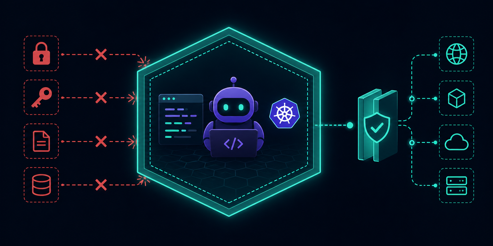
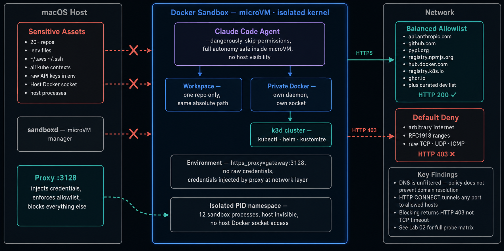

# docker-sandbox-devops

<p align="center">
  
</p>


A hands-on engineering exploration of [Docker Sandboxes](https://docs.docker.com/ai/sandboxes/) — the isolation layer for running AI coding agents safely on a developer's laptop.

> **Independent project.** Not affiliated with Docker, Inc. All findings are based on real experiments. Docker Sandboxes is Early Access — features may change. See [`tested-with.md`](./tested-with.md) for verified versions.


> **By [Shamsher Khan](https://opscart.com)** — Senior DevOps Engineer, IEEE Senior Member,
> DZone Core Member, CNCF blog contributor. Part of the
> [OpsCart](https://opscart.com) technical publication focused on
> Kubernetes, Docker, and platform engineering.

---

## The problem this solves

You run Claude Code, Copilot CLI, or Gemini CLI on your laptop. The agent has your full user permissions — every repo, every `.env` file, every kubeconfig context. You give it a task and walk away.

Docker Sandboxes runs the agent in a microVM. You mount one directory. The agent sees one directory. Your other repos, credentials, and cluster contexts don't exist inside the sandbox.

```
Without sandbox                    With Docker Sandbox
─────────────────                  ───────────────────────────────
Agent → full laptop access         Agent → one repo, one cluster
       ↳ all repos                        proxy injects credentials
       ↳ ~/.aws, ~/.ssh                   private Docker daemon
       ↳ all kube contexts               network policy enforced
       ↳ raw API keys in env             kernel-level isolation
```

---

## What's in this repo

### Labs — 5 verified, real terminal output only

| Lab | What it covers | Key finding |
|---|---|---|
| [01 — Install and first run](./labs/01-install-and-first-run/) | `sbx` install, login, daemon lifecycle, network policy selection | Daemon auto-starts on `sbx run`; `sbx version` reports unavailable when daemon is stopped |
| [02 — Network policy probes](./labs/02-network-policy-probes/) | Balanced policy probe matrix across 13 endpoints | Blocking is HTTP 403, not TCP; DNS unfiltered; HTTP CONNECT allows any port to allowed hosts |
| [03 — Isolation verification](./labs/03-isolation-verification/) | Filesystem, process, Docker daemon, credential, host network probes | Private Docker Engine per sandbox; credentials never in env; localhost is sandbox-scoped |
| [04 — Parallel coding agents](./labs/04-parallel-coding-agents/) | `--branch` mode, Git worktrees, multi-agent on one repo | `--branch` shares one microVM; isolation is Git-level not VM-level |
| [05 — DevOps workloads](./labs/05-devops-workloads/) | Custom template with kubectl, helm, kustomize, azure-cli | kustomize ARM64 install script fails silently; template iteration cycle is the real friction |

### Scenarios — integrated real-world workflows

| Scenario | What it shows | Status |
|---|---|---|
| [Kubernetes debugging](./scenarios/kubernetes-debugging/) | AI agent fixes a broken deployment against a real cluster — both k3d (self-contained) and external cluster approaches | ✅ Complete |
| Multi-agent orchestration | True VM-level isolation using separate workspace directories | 🚧 Planned |
| CI/CD safe testing | Agent tests pipeline changes safely before running in real CI | 🚧 Planned |

### Docs — synthesized findings

| Doc | Contents |
|---|---|
| [`docs/00-overview.md`](./docs/00-overview.md) | What Docker Sandboxes is, at engineering depth |
| [`docs/architecture-notes.md`](./docs/architecture-notes.md) | microVM, proxy, credential flow, gateway bridge |
| [`docs/threat-model.md`](./docs/threat-model.md) | What's protected, what has nuance, what isn't |
| [`docs/comparison-notes.md`](./docs/comparison-notes.md) | `docker run` vs `sbx run` — verified from lab findings |
| [`docs/friction-log.md`](./docs/friction-log.md) | Dated, real-time capture of what broke and how it was fixed |

---

## Architecture

<p align="center">
  
</p>

---
## Quick start

```bash
# Install
brew install docker/tap/sbx    # macOS
winget install Docker.sbx      # Windows

# Login and select network policy
sbx login

# Run your first sandbox
sbx run claude

# Verify isolation
sbx exec -it <sandbox-name> bash
env | grep -i anthropic    # empty — credentials never enter the sandbox
ls /Users/<you>/           # shows only the mounted project
```

Start with [`labs/01-install-and-first-run/`](./labs/01-install-and-first-run/) for a complete walkthrough.

---

## Kubernetes debugging scenario

The flagship scenario: an AI agent investigates and fixes a broken Kubernetes deployment — running an entire k3d cluster inside the sandbox using the private Docker daemon.

```bash
# 1. Start sandbox with DevOps toolkit
sbx run claude \
  --template shamsk22/sbx-devops-toolkit:v1.1.0 \
  --name kubernetes-debugging

# 2. Create k3d cluster inside the sandbox (sbx-specific fixes included)
bash scripts/k3d-create-sbx.sh

# 3. Deploy broken app and give agent the task
bash scripts/reset-demo.sh
# → agent finds two bugs, fixes manifests, redeploys, verifies stability
# → destroy sandbox: cluster, workloads, and agent state are all gone
```

> **Why k3d inside the sandbox needs a special script:** the microVM kernel doesn't expose `/dev/kmsg` and doesn't support VXLAN (flannel's default backend). See [`docs/friction-log.md`](./docs/friction-log.md) for the full diagnostic trail and the three-part fix.

---

## Custom DevOps template

```dockerfile
FROM docker/sandbox-templates:claude-code-docker
# adds: kubectl v1.31.4, helm v3.16.4, kustomize v5.4.3, azure-cli 2.86.0, k3d v5.7.4
```

Built and published at `shamsk22/sbx-devops-toolkit:v1.1.0`. Build your own:

```bash
docker build --platform linux/arm64 \
  -t <your-registry>/sbx-devops-toolkit:v1.0.0 \
  templates/dev-environment/
docker push <your-registry>/sbx-devops-toolkit:v1.0.0
```

---

## Repo layout

```
docker-sandbox-devops/
├── docs/
│   ├── 00-overview.md          # engineering overview
│   ├── architecture-notes.md   # microVM, proxy, credential flow
│   ├── threat-model.md         # what's protected and what isn't
│   ├── comparison-notes.md     # docker run vs sbx run (lab-verified)
│   └── friction-log.md         # live log — what broke and how it was fixed
├── labs/
│   ├── 01-install-and-first-run/
│   ├── 02-network-policy-probes/
│   ├── 03-isolation-verification/
│   ├── 04-parallel-coding-agents/
│   └── 05-devops-workloads/
├── scenarios/
│   └── kubernetes-debugging/
│       ├── manifests/           # working state (agent writes here)
│       ├── manifests-broken/    # original broken state for demo resets
│       ├── TASK.md              # agent's instruction file
│       └── FINDINGS.md          # agent-generated findings report
├── templates/
│   └── dev-environment/
│       └── Dockerfile           # DevOps toolkit image
├── scripts/
│   ├── k3d-create-sbx.sh        # k3d cluster creation with sbx fixes
│   └── reset-demo.sh            # restore broken state for repeated demos
├── tested-with.md               # sbx version + per-lab verification status
└── CLAUDE.md                    # context file for Claude Code
```

---

## Tested with

| Component | Version |
|---|---|
| `sbx` | v0.30.0 |
| Host | macOS Apple Silicon |
| DevOps template | `shamsk22/sbx-devops-toolkit:v1.1.0` |
| k3d | v5.7.4 |
| k3s | v1.30.4+k3s1 |

All labs verified. See [`tested-with.md`](./tested-with.md) for per-lab status.

---

## Contributing

Issues, kit contributions, scenario PRs, and friction-log entries are welcome. See [`CONTRIBUTING.md`](./CONTRIBUTING.md).

No invented terminal output. No unverified claims. Vendor-neutral tone.

## License

MIT. See [`LICENSE`](./LICENSE).

## Maintainer

**[Shamsher Khan](https://opscart.com)** — Senior DevOps Engineer managing 8+ AKS clusters
for Fortune 500 clients. IEEE Senior Member · DZone Core Member · CNCF blog contributor.

- 🌐 [opscart.com](https://opscart.com)
- 🐙 [github.com/opscart](https://github.com/opscart)
- 📝 [DZone profile](https://dzone.com/users/shamsk22)